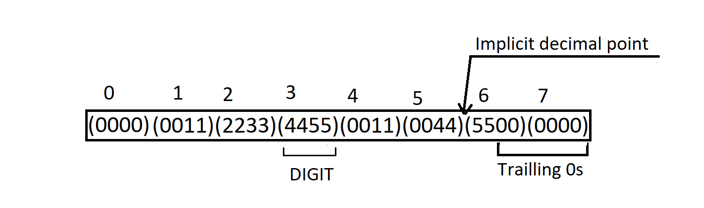

```{r setup, include=FALSE}
knitr::opts_chunk$set(echo = TRUE)
```

# Introduction

In the realm of mathematics and computation, precision plays a crucial role in achieving accurate and reliable results. Traditional data types in programming languages often have limitations when it comes to handling extremely large numbers or performing calculations with high precision. To address this challenge, our project aims to provide a robust and efficient library for performing arithmetic operations with arbitrary precision. This library offers a custom `num` class that allows users to work with numbers of virtually any size (provided that they have enough memory) and perform mathematical operations with exceptional precision.

Whether you need to calculate mathematical constants, solve complex equations, or perform intricate financial calculations, our library provides the tools necessary to achieve accurate results. The key features of this library include support for arithmetic operators (addition, subtraction, multiplication, division), comparison operators (less than, greater than, equal to), mathematical functions (square root, trigonometric functions, etc.), and convenient initialization methods for creating `num` objects.

To ensure the reliability and accuracy of this library, I have tested it by calculating mathematical constants, such as pi, e, and the golden ratio, to an impressive number of decimal places. The results have demonstrated a high level of accuracy, verifying the effectiveness in handling complex computations with precision.

In this documentation, you will find explanations of the library's functionalities, examples, and pseudocode for various algorithms implemented within the library.

# Methodology

## Intuition

Our objective is to store large numbers without sacrificing precision. Traditional floating-point representations suffer from precision loss, making them unsuitable for our needs. Therefore, we adopt a fixed-point system to ensure accuracy. To store the digits of a number, we utilize an array or vector. For instance, if we desire a precision of eight digits, four digits before the decimal and four digits after the decimal,  the number 12.3 is represented as [(0)(0)(1)(2).(3)(0)(0)(0)]. The decimal point is implicit as we work in fixed-point representation.

Since our precision requirement is four digits, the decimal point will always be located just before the fourth-to-last element in the array. By performing arithmetic operations digit by digit, we can achieve precise computations.

However, storing one digit per array element is inefficient in terms of space utilization. Upon further consideration, we realize that storing two digits in each element allows us to work effectively in a base 100 system. This concept can be extended to store 8 or 9 digits in each element.

To handle negative numbers, we draw inspiration from the widely used two's complement system employed in computers. Assuming a precision of two digits, we represent numbers as follows:

| Number | Representation      |
|--------|---------------------|
| 1.1    | [ (0) (1) (1) (0) ] |
| 12     | [ (1) (2) (0) (0) ] |
| 0.1    | [ (0) (0) (1) (0) ] |
| -1     | [ (9) (9) (0) (0) ] |
| -1.2   | [ (9) (8) (8) (0) ] |

: Examples of number representation in commputer memory

To determine the representation of -1.2, we first express 1.2 as [(0)(1)(2)(0)]. Next, we take the nine's complement of each digit, resulting in [(9)(8)(7)(9)]. Finally, we add [(0)(0)(0)(1)] to obtain the representation of -1.2 as [(9)(8)(8)(0)].

## Implementation

We implement a fixed-point number class from scratch, utilizing a vector of type long long to store the digits of our number. Each element in the vector is a 64-bit integer, capable of holding 18-digit numbers. However, to avoid potential overflow issues during multiplication, we choose to store a maximum of 9 digits in each element.

To establish the precision of our class, we introduce the following variables:

$K$ : base_lenght:  The number of decimal digits in each element (DIGIT).

$B$ : number_base: The base we work with, equal to $10^K$.

$N$ : nDigitsBeforeDecimal: The number of DIGITs before the decimal point.

$M$ : nDigitsAfterDecimal: The number of DIGITs after the decimal point.

Consider the example of storing the number 112233445500110044.55. Assuming a $K$ of 4, $N$ of 6, and $M$ of 2, the $B$ would be 10,000.

In this case, the length of the vector is determined by $N + M$, denoted as $L$ : nDIGITS and we can represent numbers from -5000 0000 0000 0000 0000 0000.0000 0000 to 4999 9999 9999 9999 9999 9999.9999 9999 with increments of 0.0000 0001. By structuring our fixed-point number class in this manner, we ensure efficient and precise storage of numbers within the specified precision constraints.



# Documentation

This documentation will walk you through various essential aspects of the High Precision Computing Library. Each method is thoroughly explained, including its purpose, input parameters, return values, and any exceptions it may throw. Code examples are provided to illustrate how to use the methods effectively in your computations.

## Class

The definition of the class is shown below.

``` cpp
typedef long long ll;
class num{
    private:
    static ll nDigits_Before_Decimal; 
    static ll nDigits_After_Decimal;
    static ll number_base, base_length; 
    static ll nDIGITS;
    static bool PRECISION_SET;
    std::vector<ll> digits;
    
    public:
    num();
    num(const num& b); 
    num(std:: string arr);
    num(ll integer);
    num& operator=(const num &b);

    // helper functions
    private:
    static ll strToDIGIT(std:: string str, int length);
    static ll strToDIGIT2(std:: string str, int length);
    static std:: string DIGITtoString(ll number);
    void negate();
    public: 
    bool signum() const;
    static void shiftnum(num &x, ll s);
    static std:: string NumToString(const num &x);
    static void setPrecision(ll DigitsBeforeDecimal, ll DigitsAfterDecimal, ll baseLength);
    
    // Comparision operators
    bool operator==(const num &b) const;
    bool operator!=(const num &b) const;

    bool operator>(const num &b) const;
    bool operator>=(const num &b) const;
    bool operator<(const num &b) const;
    bool operator<=(const num &b) const;

    // Arithematic Operators
    num operator+(const num &b) const; 
    num operator-(const num &b) const; 
    num operator-() const; 
    num operator*(const num &b) const;
    num operator*(ll b) const; 
    num reciprocal() const;
    num operator/(const num &b) const; 
    num operator/(ll b) const; 

    // Declare math functions
    public:
    static num int_reciprocal(ll x);
    static num sqrt(const num &x);
    static num arctan(const num &x);
    static num arctanOfReciprocal(ll x);
};
std:: ostream& operator<<(std:: ostream& os, num number);
```

## Member variables

+--------------------------+-------------+---------------------+-------------------------------------------+
| Variable name            | Alias       | Type                | Purpose                                   |
+==========================+=============+=====================+===========================================+
| `nDigits_Before_Decimal` | $N$         | `static long long`  | Number of DIGITs before the decimal       |
+--------------------------+-------------+---------------------+-------------------------------------------+
| `nDigits_After_Decimal`  | $M$         | `static long long`  | Number of DIGITs after the decimal        |
+--------------------------+-------------+---------------------+-------------------------------------------+
| `base_length`            | $K$         | `static long long`  | Number of decimal digits in each DIGIT    |
+--------------------------+-------------+---------------------+-------------------------------------------+
| `number_base`            | $B$         | `static long long`  | Base of our number system $=10^K$         |
+--------------------------+-------------+---------------------+-------------------------------------------+
| `nDIGITS`                | $L$         | `static long long`  | Makes code more readable. $L=N+M$         |
+--------------------------+-------------+---------------------+-------------------------------------------+
| `PRECISION_SET`          |             | `bool`              | Tracks whether the precision has been set |
+--------------------------+-------------+---------------------+-------------------------------------------+
| `digits`                 |             | `vector<long long>` | It stores the actual digits of our number |
+--------------------------+-------------+---------------------+-------------------------------------------+

: All variables used in the number class private.

## Member functions

The class provides functions for initializing number objects in different ways, including constructors for instantiating numbers from integers or strings. It also includes various arithmetic operators such as addition, subtraction, multiplication, and division, allowing easy computations. The comparison operators are implemented to perform comparisons between numbers, including equality and inequality checks. Additionally, the class offers mathematical functions such as square root and arctangent that will be useful when we implement testing.

### Initialization functions

+---------+---------+----------------+---------+-----------------------------+---------------------+
| Sr.     | Name    | Arguments      | Return  | Purpose                     | Usage               |
+=========+=========+================+=========+=============================+=====================+
| 1       | `num`   | `void`         | `void`  | Initializes to 0            | `num a;`            |
+---------+---------+----------------+---------+-----------------------------+---------------------+
| 2       | `num`   | `const num& x` | `void`  | Copy Constructor            | `num a; num b(a);`  |
+---------+---------+----------------+---------+-----------------------------+---------------------+
| 3       | `num`   | `string s`     | `void`  | Creates number from string  | `num a("-1.2");`    |
+---------+---------+----------------+---------+-----------------------------+---------------------+
| 4       | `num`   | `long long x`  | `void`  | Creates number from int64_t | `num a(23);`        |
+---------+---------+----------------+---------+-----------------------------+---------------------+
| 5       | `=`     | `const num& x` | `num&`  | Assignment Operator         | `num a; num b = a;` |
+---------+---------+----------------+---------+-----------------------------+---------------------+

: List of various initializers.

These constructors provide convenient ways to instantiate **`num`** objects using different types of input data. The initialization of **`num`** objects is carried out digit by digit.

For the implementation and inner workings of the **`num(string)`** constructor, refer to the pseudocode provided in the appendix of this documentation. The implementation of other constructors, such as those accepting integers or the copy constructor, follows a straightforward approach.

### Helper functions

These function facilitate working with the `num` objects. All the helper functions are static.

+---------+-----------------------+-----------------------+-------------+-------------------------------------------+------------------------+
| Sr.     | Name                  | Argument              | Return      | Purpose                                   | Usage                  |
+=========+=======================+=======================+=============+===========================================+========================+
| 1       | `strToDIGIT`          | `sting s, int k`      | `long long` | \--private                                | \--private             |
+---------+-----------------------+-----------------------+-------------+-------------------------------------------+------------------------+
| 2       | `strToDIGIT2`         | `string s, int k`     | `long long` | \--private                                | \--private             |
+---------+-----------------------+-----------------------+-------------+-------------------------------------------+------------------------+
| 3       | `DIGITtoString`       | `long long k`         | `string`    | \--private                                | \--private             |
+---------+-----------------------+-----------------------+-------------+-------------------------------------------+------------------------+
| 4       | `static NumToString`  | `num& x`              | `string`    | Convers a `num` to `string`               | `num a("-1.33");`      |
|         |                       |                       |             |                                           |                        |
|         |                       |                       |             |                                           | `NumToSting(a);`       |
+---------+-----------------------+-----------------------+-------------+-------------------------------------------+------------------------+
| 5       | `signum`              | `void`                | `bool`      | Returns true if the `num` is non-negative | `num a("1.2");`        |
|         |                       |                       |             |                                           |                        |
|         |                       |                       |             |                                           | `if(a.signum());`      |
+---------+-----------------------+-----------------------+-------------+-------------------------------------------+------------------------+
| 6       | `static shiftnum`     | `num& x, long long k` | `void`      | Perform right shift                       | `num a("12.2");`       |
|         |                       |                       |             |                                           |                        |
|         |                       |                       |             |                                           | `shift(a, 2);`         |
+---------+-----------------------+-----------------------+-------------+-------------------------------------------+------------------------+
| 7       | `static setPrecision` | `long long x,y,z`     | `void`      | To set the precision                      | `setPrecision(2,3,5);` |
+---------+-----------------------+-----------------------+-------------+-------------------------------------------+------------------------+

: List of helper functions.

The `shiftnum` function is designed to perform a right shift on the DIGITs of a given number (`num`) in place. It is important to note that this function is intended to be used only for positive `num` objects. If a negative `num` is provided as the input (`x`), a logic error will be thrown.

The function takes two arguments: `x`, which is a reference to the `num` object to be shifted, and `k`, which represents the number of positions to shift the DIGITs. If `k` is negative, a left shift of `|k|` positions is performed on the DIGITs array. In other words, each digit is moved `|k|` positions to the left.

Before initializing a **`num`** object, it is essential to set the precision for your program. Failure to set the precision may result in a runtime error when constructing a **`num`** object. The precision should only be set once throughout your program execution.

To set the precision, use the **`setPrecision`** function, specifying the desired number of digits before and after the decimal point, along with the base length. However, if you attempt to set the precision more than once, the **`setPrecision`** function will throw an exception.

The third argument of the **`setPrecision`** function represents the value of $K$, which must be less than 10. If the provided value exceeds this limit, the function will also throw an exception.

Ensure that you set the precision correctly before working with **`num`** objects to ensure accurate computations.

### Comparison functions

The **`num`** class offers operator overloading for all the standard comparison operators: $<,\ >,\ \le,\ \text{and}\ \ge$. These operators allow you to compare **`num`** objects and determine their relative magnitudes. Each comparison operator is a const function that returns a boolean value.

To use the comparison operators, simply use the appropriate operator symbol between two **`num`** objects, for example, **`A < B`** to check if **`num A`** is less than **`num B`**.

For a detailed understanding of the implementation and inner workings of the less than operator, refer to the pseudocode provided in the appendix of this documentation.

### Arithmetic functions

All arithmetic functions are const functions with return type `num` .

| Sr. | Oparator     | Argument      | Time complexity          |
|-----|--------------|---------------|--------------------------|
| 1   | \+           | `num& b`      | $O(L)$                   |
| 2   | \-           | `num& b`      | $O(L)$                   |
| 3   | \-           | `void`        | $O(L)$                   |
| 4   | \*           | `num& b`      | $O(L^2)$                 |
| 5   | \*           | `long long b` | $O(L)$                   |
| 6   | /            | `num& b`      | $O(L^2\log_2(L\cdot K))$ |
| 7   | /            | `long long b` | $O(L)$                   |
| 8   | `reciprocal` | `void`        | $O(L^2\log_2(L\cdot K))$ |

: Operator overloading for common math operations.

The arithmetic operations of addition and subtraction in the **`num`** class are performed digit by digit, starting from the rightmost digit and moving towards the left. Similarly, multiplication and division by **`long long`** numbers are executed digit by digit, following the same right-to-left approach. It is important to note that the argument of these operators must be less than $B$, to prevent any potential overflows during multiplication. When performing division, it is essential to ensure that the divisor is not zero. Otherwise, a **`logic_error`** will be thrown to handle this invalid operation.

The **`reciprocal()`** method is a helper function used to calculate the reciprocal of the current **`num`** object. This method is implemented using Newton's method, which provides an efficient approximation for finding the reciprocal.

Let $a>0$ be the given number. Our goal is to find $x$ such that $\frac1x-a = 0$.

Let $f(x) = \frac1x-a$ $\implies f'(x) = -\frac1{x^2}$.

Using the Newton's method, if we start from a guess $x_0$ and iteratively generate $x_1,\ x_2\ \dots\ x_n$ which are better and better approximations for the root of $f(x)$. For $k\ge0$, $$x_{k+1} = x_{k} - \frac{f(x_k)}{f'(x_k)}=2x_k-ax_k^2$$Newton's method has been shown to converge quadraticaly which means the number of correct decimal places in the guess roughly doubes every iteration which means we will have to do at most $\log(L\cdot K)$ iterations.

For detailed information on the algorithms and implementations of the multiplication, reciprocal, and division operations, refer to the pseudocode provided in the appendix of this documentation.

### Math functions

In addition to the core functionality of the library, several useful math functions have been implemented to facilitate testing and enhance the versatility of the library. These functions can be employed to perform various mathematical calculations and validate the accuracy of the library's numerical operations by calculating numerical constants.

+----------+----------------------+---------------+----------+------------------------------+--------------------------+
| Sr.      | Name                 | Arguments     | Return   | Purpose                      | Usage                    |
+==========+======================+===============+==========+==============================+==========================+
| 1        | `sqrt`               | `num x`       | `num`    | returns $\sqrt{x}$           | `num a;`                 |
|          |                      |               |          |                              |                          |
|          |                      |               |          |                              | `num b = sqrt(a);`       |
+----------+----------------------+---------------+----------+------------------------------+--------------------------+
| 2        | `int_reciprocal`     | `long long x` | `num`    | returns $\frac1x$            | `int_reciprocal(4);`     |
+----------+----------------------+---------------+----------+------------------------------+--------------------------+
| 3        | `arctan`             | `num x`       | `num`    | returns $\tan^{-1}(x)$       | `num a;`                 |
|          |                      |               |          |                              |                          |
|          |                      |               |          |                              | `num b = arctan(a);`     |
+----------+----------------------+---------------+----------+------------------------------+--------------------------+
| 4        | `arctanOfReciprocal` | `long long x` | `num`    | returns $\tan^{-1}(\frac1x)$ | `arctanOfReciprocal(3);` |
+----------+----------------------+---------------+----------+------------------------------+--------------------------+

: List of math functions written in the library to facilitate testing

The sqrt function is implemented using the Newton's method. Let the input to the function be $a$. We want to find the root of the function $f(x) = x^2-a. \ \text{Now } f'(x) =2x$ . Steps involved in the Newton's algorithm are:

Set $x_0$ to be a guess for the root of $f(x)$. Then $\forall\  k\ge 0,$ $x_{k+1} = x_k-\frac{f(x_k)}{f'(x_k)}$. $$x_{k+1}=\frac12(x_k+\frac{a}{x_k})$$

Since the Newtons method has been shown to converge quadratically the number of correct decimal digits in $x_k$ roughly doubles every iteration hence the number of iteration of the newtons algorithm we need is $\log_2(L\cdot K)$

`int_reciprocal` function is implemented by the long division algorithm which is quite staightforward.

`arctan` function and `arctanOfReciprocal` function are implemented using the taylor series expantion of the $\tan^{-1}(x)$. $$\tan^{-1}(x)=x-\frac{x^3}{3!}+\frac{x^5}{5!}-\frac{x^7}{7!}\cdots$$

The terms $\frac{x^k}{k!}$ are added until $\frac{x^k}{k!}$ goes out of precision and becomes 0.

For detailed information on the algorithms and implementations of these functions refer to the pseudocode provided in the appendix of this documentation.

# Testing

To test the library's accuracy and performance, one approach is to calculate mathematical constants to a large number of decimal places. This involves using the library's numerical operations and functions to compute well-known mathematical constants, such as $\pi$ to a high precision.

The testing process can be divided into the following steps:

1.  Select the mathematical constant to be calculated.

    +-------------------------------+--------------------------------------------------------------------------------------------+-----------------+
    | Name                          | Formula                                                                                    | Target decimals |
    +===============================+============================================================================================+=================+
    | Pythagoras's constant $(\pi)$ | $$                                                                                         | $1,00,000$      |
    |                               |                                  \frac{\pi}{4} = \tan^{-1}(\frac15)+\tan^{-1}(\frac1{239}) |                 |
    |                               |                                  $$                                                        |                 |
    +-------------------------------+--------------------------------------------------------------------------------------------+-----------------+
    | Euler's number $(e)$          | $$                                                                                         | $1,00,000$      |
    |                               |                                  e= 1+ \frac{1}{1!}+\frac{1}{2!}+\frac{1}{3!}+\cdots       |                 |
    |                               |                                  $$                                                        |                 |
    +-------------------------------+--------------------------------------------------------------------------------------------+-----------------+
    | Golden Ratio $(\phi)$         | $$                                                                                         | $1,00,000$      |
    |                               |                                  \frac{\sqrt{5}+1}{2}                                      |                 |
    |                               |                                  $$                                                        |                 |
    +-------------------------------+--------------------------------------------------------------------------------------------+-----------------+

    : Mathematical constants used for testing

2.  Determine the desired number of decimal places for the calculation. This will determine the required precision of the library.

3.  Implement the necessary algorithms or formulas to compute the constant using the library's operations and functions.

4.  Perform the calculation and compare the result with known values or reference implementations obtained from reliable sources.

5.  Measure the performance of the library during the calculation, including the time taken to compute the constant to the desired precision.

This testing approach helps ensure that the library performs accurately and consistently for various mathematical calculations in real-world applications.

|                  |                                             |
|------------------|---------------------------------------------|
| Operating system | Windows 11 build 22631.1972                 |
| Processor        | 11th Gen Intel(R) Core i5-1135G7 \@ 2.40GHz |
| System type      | 64-bit operating system, x64-processor      |
| RAM              | 16 GB DDR5                                  |
| GPU              | Intel Iris XE Graphics                      |

: Specifications of the computer system used for testing.

The C++ code used for testing is provided in the appendix to this document. Time taken for execution will vary across different systems but the results are still reproducible.

+-------------+----------------+-------------------+---------------------+-------------+
| Constant    | Target decimal | Accurate Decimals | Time taken(seconds) | Accuracy    |
+=============+================+===================+=====================+=============+
| $\pi$       | 1,00,000       | 99,997            | 52.704              | 99.997%     |
+-------------+----------------+-------------------+---------------------+-------------+
| $e$         | 1,00,000       | 99,997            | 9.763               | 99.997%     |
+-------------+----------------+-------------------+---------------------+-------------+
| $\phi$      | 1,00,000       | 99,999            | 558.673             | 99.999%     |
+-------------+----------------+-------------------+---------------------+-------------+

: Results of testing

Resources used for varification are [University](http://www.geom.uiuc.edu/~huberty/math5337/groupe/digits.html)[of Illinois](ss) for $\pi$, [nasa.gov](https://apod.nasa.gov/htmltest/gifcity/e.1mil) for $e$, and [goldenratio](https://www.goldenratio.org/)[.org](ss) for $\phi$.

# Conclusion

The library supports high precision through the use of a custom `num` class that handles large numbers with a flexible number of digits. The implementation utilizes efficient algorithms and techniques, such as Newton's method for reciprocal calculations, Taylor series expansions for trigonometric functions, approximation techniques for square root calculations.

This library offers a wide range of mathematical operations, including arithmetic operators, comparison operators, mathematical functions, and initialization methods. I have provided detailed documentation, including pseudocode, to assist users in understanding the inner workings of the library. Users can write their own functions as per their need and requirement.

The testing process has demonstrated the accuracy and reliability of our library, with results that closely match known values with a high level of precision.

# Appendix

This appendix contains the pseudocode for selected functions.

## Testing

### Code for calculating $\pi$

``` cpp
    // set precision
    int N = 2, M = 12500, K= 8;
    num:: setPrecision(N, M, K);
    // start the clock
    clock_t tStart = clock();
    // calculate pi
    num pi = num::arctanOfReciprocal(5) * 16 - num::arctanOfReciprocal(239) * 4;
    std:: string calculated_pi = num::NumToString(pi);

    // read the true value of pi from pi.txt
    std:: string true_pi;
    std:: ifstream pi_txt("pi.txt");
    std:: getline(pi_txt, true_pi);

    // compare digits, and report the first unequal digit
    int i = 0;
    while(i<true_pi.length() && i<calculated_pi.length() &&  true_pi[i] == calculated_pi[i]){
        i++;
    }
    std::cout<<"First wrong digit is " << i<<std::endl;
    
    // report the time taken
    std:: cout<< "Time taken:" << (double)(clock() - tStart) / CLOCKS_PER_SEC << std:: endl;
```

### **Code for calculating** $e$

``` cpp
   // set precision
    int N = 5, M = 12500, K= 8;
    num:: setPrecision(N, M, K);
    // start the clock
    clock_t tStart = clock();
    // calculate e
    num e(0);
    num term(1);
    num zero(0);
    long long r = 1;
    while(term != zero){
        e = e + term;
        term = term/r;
        r++;
    }

    
    std:: string calculated_e = num::NumToString(e);

    // read the true value of e from e.txt
    std:: string true_e;
    std:: ifstream e_txt("e.txt");
    std:: getline(e_txt, true_e);
    
    // compare digits, and report the first unequal digit
    int i = 0;
    while(i<true_e.length() && i<calculated_e.length() &&  true_e[i] == calculated_e[i]){
        i++;
    }
    std::cout<<"First wrong digit is " << i<<std::endl;
    
    // report the time taken
    std:: cout<< "Time taken:" << (double)(clock() - tStart) / CLOCKS_PER_SEC << std:: endl; 
```

### **Code for calculating** $\phi$

``` cpp
    // set precision
    int N = 125, M = 125, K= 8;
    num:: setPrecision(N, M, K);
    // start the clock
    clock_t tStart = clock();
    // calculate phi
    num phi = (num::sqrt(num(5))+num(1))/2;
    
    std:: string calculated_phi = num::NumToString(phi);

    // read the true value of phi from GoldenRatio.txt
    std:: string true_phi;
    std:: ifstream phi_txt("GoldenRatio.txt");
    std:: getline(phi_txt, true_phi);
    
    // compare digits, and report the first unequal digit
    int i = 0;
    while(i<true_phi.length() && i<calculated_phi.length() &&  true_phi[i] == calculated_phi[i]){
        i++;
    }
    std::cout<<"First wrong digit is " << i<<std::endl;
    
    // report the time taken
    std:: cout<< "Time taken:" << (double)(clock() - tStart) / CLOCKS_PER_SEC << std:: endl;
```

## Math

### sqrt(num&)

``` cpp
function sqrt(x: num) -> num
    guess: num
    if x <= 0 then
        throw "Can't calculate the sqrt of a negative number"
    
    i := 0
    while i < nDIGITS and x.digits[i] = 0 do
        i := i + 1
    
    if (i - nDigits_Before_Decimal + 1) mod 2 = 0 then
        guess.digits[(i + nDigits_Before_Decimal - 1) div 2] := sqrt(x.digits[i])
    else
        guess.digits[(i + nDigits_Before_Decimal + 1) div 2] := sqrt(x.digits[i] * number_base + x.digits[i + 1])
    
    logLK := log2(base_length * nDIGITS) + 2
    for i := 0 to logLK do
        guess := (guess + (guess.reciprocal() * x)) / 2
    
    return guess
end function
```

### int_reciprocal(long long)

``` cpp
function int_reciprocal(x: ll) -> num
    if x = 0 then
        throw "division by zero"
    
    positive := x > 0
    if not positive then
        x := -x
    
    ans: num
    remainder := 1
    
    for i := nDigits_Before_Decimal to nDIGITS - 1 do
        ans.digits[i] := (remainder * number_base) / x
        remainder := (remainder * number_base) mod x
    
    if not positive then
        ans.negate()
    
    return ans
end function
```

### arctan(num&)

``` cpp
function arctan(x: num) -> num
    xx := x * x
    ans := 0
    zero := 0
    term := x
    
    i := 1
    while term != zero do
        if i % 2 = 1 then
            ans := ans - term / i
        else
            ans := ans + term / i
        term := xx * term
        i := i + 2
    
    return ans
end function
```

### arctanOfReciprocal(long long)

``` cpp
function arctanOfReciprocal(x: ll) -> num
    xx := x * x
    ans := 0
    zero := 0
    term := int_reciprocal(x)
    
    i := 1
    while term != zero do
        if i % 2 = 1 then
            ans := ans - term / i
        else
            ans := ans + term / i
        term := term / xx
        i := i + 2
    
    return ans
end function
```

## Operator\<(num&)

``` cpp
function operator<(b: num) -> result: bool
    if this->sign() is equal to b.sign() then
        for i from 0 to nDIGITS - 1 do
            if digits[i] is not equal to b.digits[i] then
                return digits[i] < b.digits[i]
        return false
    
    return b.sign()
```

## Multiplication

### operator\*(num&)

``` cpp
function operator*(c: num) -> prod: num
    // Prepare variables and handle signs
    b = c // create a copy of the input number c
    a = this // create a copy of the current number
    sameSign = a.signum() is equal to b.signum() // determine if the final result should have the same sign

    // Handle negative numbers by converting them to positive
    if a.signum() is false then
        a.negate()
    if b.signum() is false then
        b.negate()

    // Create an empty array to hold the temporary result
    ans = new vector of size 2*nDIGITS initialized with zeros

    // Perform the multiplication
    for i from 0 to nDIGITS - 1 do
        // Skip multiplication if the digit is zero
        if b.digits[i] is zero then
            continue

        for j from 0 to nDIGITS - 1 do
            ans[i + j + 1] += a.digits[j] * b.digits[i] 
            // multiply and accumulate the partial products

    // we did not take carry in the previous step so we do it now
    for i from 2*nDIGITS - 1 to 1 do
        ans[i - 1] += ans[i] / number_base // carry over the excess digits
        ans[i] = ans[i] % number_base // keep only the remainder

    // Set the answer variable
    prod = new num

    for i from 0 to nDIGITS - 1 do
        prod.digits[i] = ans[nDigits_Before_Decimal + i] 
        // copy the appropriate DIGIT from the temporary array to the product variable

    // Adjust the sign of the result
    if sameSign is false then
        prod.negate()

    return prod
```

### operator\*(long long)

``` cpp
function operator*(x: ll) -> ans: num
    // Prepare variables and handle signs
    ans = new num
    y = this // create a copy of the current number
    sameSign = y.signum() is equal to (x > 0) 
    // determine the sign of final result 

    // Handle negative numbers by converting them to positive
    if y.signum() is false then
        y = -y
    if x < 0 then
        x = -x

    carry = 0
    for i from nDIGITS - 1 to 0 do
        temp = y.digits[i] * x + carry 
        // multiply the digit with x and add any carry from previous calculations
        ans.digits[i] = temp % number_base 
        // store the remainder in the appropriate digit of the result
        carry = temp / number_base // calculate the carry for the next iteration

    if sameSign is true then
        return ans
    else
        return -ans
```

## Division

### operator/(num&)

``` cpp
function num::operator/(const num &b) returns num
    num y
    if b == y then
        throw logic_error("Division by 0")
    
    num x <- this
    y <- b
    bool sameSign <- x.signum() == y.signum()
    
    if not x.signum() then
        x <- -x
    
    if not y.signum() then
        y <- -y
    
    int i <- 0
    num p, q
    
    while y.digits[i] == 0 do
        i <- i + 1
    
    int shift <- nDigits_Before_Decimal - i - 1
    shiftnum(x, shift) // Right shift x by the appropriate number of digits
    shiftnum(y, shift) // Right shift y by the same number of digits
    
    if sameSign then
        return x * y.reciprocal() // Perform division by multiplying x with the reciprocal of y
    
    return -x * y.reciprocal() // Perform division and negate the result if signs are different
end function
```

### operator/(long long)

``` cpp
function operator/(x: ll) -> ans: num
    if x is equal to 0 then
        throw a logic_error("Division by zero")

    ans = new num
    y = this // create a copy of the current number
    sameSign = y.signum() is equal to (x > 0) 
    // determine the sign of the final result

    // Handle negative numbers by converting them to positive
    if y.signum() is false then
        y = -y
    if x < 0 then
        x = -x

    remainder = 0
    for i from 0 to nDIGITS - 1 do
        temp = remainder * number_base + y.digits[i] 
        // combine the remainder with the next digit of y
        ans.digits[i] = temp / x // divide the combined value by x and store the quotient
        remainder = temp % x // calculate the new remainder for the next iteration

    if sameSign is false then
        ans.negate()
    return ans
```

### reciprocal()

``` cpp
function reciprocal() -> result: num
    if *this == (num(0)) then
        throw a logic_error("division by 0 occurred")

    positive = this->signum() // get the sign of the number
    a = new num(*this)
    if a is negative then
        a.negate()

    if a.digits[0] > number_base / 4 then 
    // if the number too large we don't need to do any calculation , just return 0
        return num(0)

    r = 0
    while a.digits[r] is equal to 0 do
        r++

    guess = new num
    guess.digits[nDIGITS - 1 - r] = number_base / a.digits[r]
    two = new num(2)

    logLK = log2(base_length * (nDIGITS)) + 2
    for k from 0 to logLK do
        guess = guess * (two - a * guess)

    if not positive then
        guess.negate()

    return guess
```

## num(string)

``` cpp
function num::num(string number)
    if PRECISION_SET is false then
        throw a runtime_error("Precision not set")

    digits.resize(nDIGITS, 0)
    totalLength = 0
    charBeforeDecimal = 0
    positive = number[0] != '-'

    if positive is false then
        number = number.substr(1) // Skip the '-' symbol

    totalLength = length of number

    while charBeforeDecimal < totalLength and number[charBeforeDecimal] != '.' do
        charBeforeDecimal++

    i = nDigits_Before_Decimal - 1
    j = charBeforeDecimal

    while i >= 0 and j > base_length do
        digits[i] = stoi(number.substr(j - base_length, base_length))
        j -= base_length
        i--

    if i >= 0 then
        digits[i] = strToDIGIT(number, j)

    if totalLength is equal to charBeforeDecimal then
        // No decimal point in the string
        if(!positive) this->negate();
        return 

    charAfterDecimal = totalLength - charBeforeDecimal - 1

    i = nDigits_Before_Decimal
    j = charBeforeDecimal + 1

    while i < nDIGITS and charAfterDecimal > base_length do
        digits[i] = stoi(number.substr(j, base_length))
        i++
        charAfterDecimal -= base_length
        j += base_length

    if i < nDIGITS then
        digits[i] = strToDIGIT2(number.substr(j), charAfterDecimal)

    if positive is false then
        this->negate()
```

## NumToString(num&)

``` cpp
function NumToString(x: num) -> result: string
    result <- ""
    y <- create a copy of x using the default copy constructor
    
    if y is negative then
        append "-" to result
        y.negate() // negate the value inside the variable
    
    i <- 0
    while y.digits[i] is equal to 0 and i is less than nDigits_Before_Decimal - 1 do
        increment i by 1
    
    append y.digits[i] converted to string to result
    increment i by 1
    
    while i is less than nDigits_Before_Decimal do
        append DIGITtoString(y.digits[i]) to result
        increment i by 1
    
    t <- nDIGITS
    while y.digits[t - 1] is equal to 0 and t is greater than or equal to nDigits_Before_Decimal do
        decrement t by 1
    
    if t is not equal to nDigits_After_Decimal then
        append "." to result
        while i is less than t do
            append print_helper(y.digits[i]) to result
            increment i by 1
    
    return result
```
